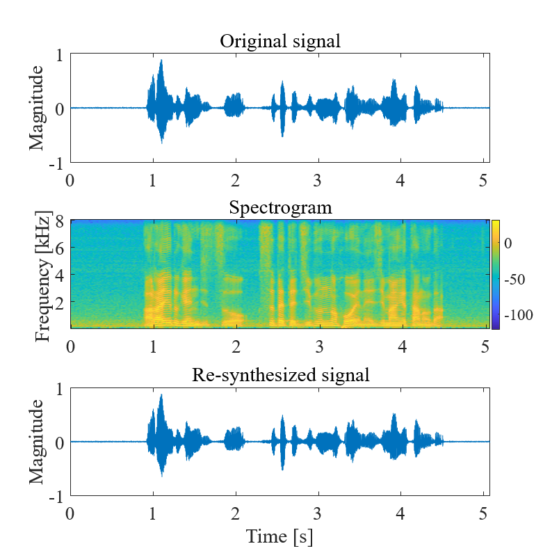

# 第一回B4輪講課題
## 課題の概要
本課題では，音声のスペクトログラムを抽出し描画を行う．

## 課題

1. 音声を収録してスペクトログラムを表示しよう！
2. スペクトログラムを逆変換して時間信号に戻そう！

## 課題の進め方

1. 音声の収録
   - 収録機器，収録音声は自由
   - 音声は1ch, 16 kHzのwav形式がおすすめ
   - 研究室の収録機材を使いたい人は応相談
2. 収録音声のスペクトログラムを描画
   - スクリプトには適切にコメントを残すこと
   - グラフの各軸はきちんと明記すること
3. 発表（次週）
   - 取り組んだ内容を周りにわかるように説明
   - コードの説明はGithubのページをそのまま使ってもいいよ
   - 発表者は当日にランダムに決めるので**スライドは全員準備**
4. スライドを`Procyon/発表資料/B4輪講/2023`にアップロード
## 結果例

## ヒント

- MATLABを使う場合|関数
  - 音声の読み込み：`audioread`
  - （高速）フーリエ変換：`fft`
  - 窓関数：`hann`, `hamming`
  - カラーデータの表示：`imagesc`

- pythonを使う場合｜モジュール，ライブラリ，関数
  - 線形代数：`scipy`, `numpy`
  - 音声の読み込み：`soundfile`, `librosa.core.load`, `scipy.io.read`, `wave`
    - SoundFile・LibROSAはそれぞれ以下の方法でインストール可能
      - pip: `pip install librosa`・`pip install SoundFile`
      - Anaconda: `conda install -c conda-forge librosa`・`conda install -c conda-forge pysoundfile`
  - （高速）フーリエ変換：`scipy.fftpack.fft`, `numpy.fft`
  - 窓関数：`scipy.signal`
  - グラフの描画：`matplotlib.pyplot`, `seaborn`, `plotly`(玄人向け)
    - いろいろ使いこなしておくといつか便利かも！？
  - 引数の解析：`argparse`

## 注意

- Pythonを利用する場合:
   - `virtualenv`や`pyenv`などを使ってライブラリの管理をすると便利です。が、最初はなくても良いと思います。
   - **Python を使う場合は必ず3系を利用しましょう！！！！ (2系はそのうちサポート終了します。)**
   - 武田研究室の場合はセットアップで作成した`virtualenv`環境を利用すること（やってない疑惑？）
      - アクティベート例：`source ~/workspace3/myvenv/bin/activate`  
      - アクティベート後`pip install ...`でライブラリのインストールを行う
   - Pythonには `PEP8` というコードのスタイルガイドがあります。これにそってコーディングを行いましょう。
      - [参考](https://blog-ja.sideci.com/entry/python-lint-pickup-5tools)
- `spectrogram`関数（MATLAB）などを使って波形データからスペクトログラムを直接求めないこと  
- `matplotlib.pyplot.specgram`関数（Python）を使って波形データからスペクトログラムを直接描画しないこと  
- `librosa.core.stft`関数（Python）などを使って波形データからスペクトログラムを直接求めないこと  
