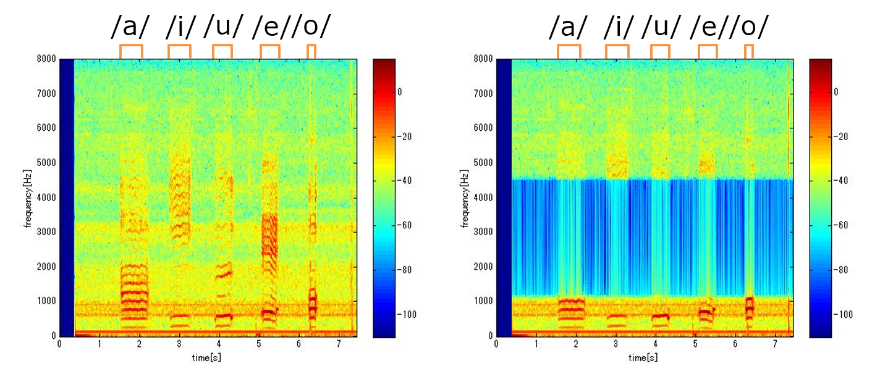

# 第2回B4輪講課題

## 課題の概要

本課題では，デジタルフィルタを作成(FIR、窓関数法)しフィルタリングを行う．

## 課題

1. 畳み込み演算を実装してみよう！

2. ディジタルフィルタを設計してみよう！(IIRにもチャレンジしていいよ)

   - **時間領域** で定義しましょう

   - 周波数特性，振幅特性を図示

   - 設計したフィルタを音声信号に畳み込んでみよう！

3. スペクトログラムを表示してフィルタリングの影響を確認してみよう！

4. フィルタリングされた音声ファイルを実際に聞いてみよう！

## 課題の進め方

1. 畳み込み演算の実装 (np.convは使わない)

2. ディジタルフィルタの設計

   - 窓関数法で設計

   - 周波数特性を描画．グラフの各軸はきちんと明記

   - **割り振り**

     * LPF: Kimihiro Hattori, Koki Morita

     * HPF: Kenjiro Ide, Takehiro Imamura

     * BPF: Tatsuru Kawanishi, Shunsuke Iwashita

     * BEF: Kenichi Ogita, Ryoya Sakaki

3. 畳み込み

3. スペクトログラムとディジタルフィルタの描画

   - 前回作成したスペクトログラムの描画を関数化して利用

   - `scipy.signal.spectrogram`を使ってもいい

4. フィルタリングされた音声の考察

5. 発表（次週）

   - 取り組んだ内容を周りにわかるように説明

   - 発表者は当日にランダムに決めるので**スライドは全員準備**

   - 担当したフィルタの利用先について調査

   - 発表資料は研究室NASにアップロードしておくこと
     `\\\procyon\\all\\発表資料\B4輪講\\2024\\<発表日>`

## 結果例

## ヒント

- 周波数領域ではなく**時間領域**で設計する

## 注意

- 武田研究室の場合はセットアップで作成した`virtualenv`環境を利用すること

    - アクティベート例：`source ~/workspace/myvenv/bin/activate`

    - アクティベート後`pip install ...`でライブラリのインストールを行う

- 自分の作業ブランチで課題を行うこと

- 畳み込み，FIRは自分で実装すること
