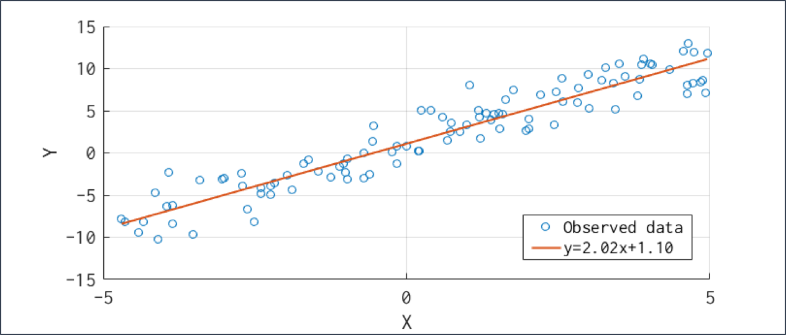

# 第三回B4輪講課題

## 課題の概要

本課題では，最小二乗法を用いて回帰分析を行う．

## 課題

1. 各データに対して回帰式を求めてグラフにプロットしてみよう
2. data3は３次元なので注意

## 課題の進め方

1. 各データの散布図をプロットして概観を把握
2. 散布図の形から最適な次数を予想
   - 次数を変えていいろいろ試してみよう
3. 回帰式のプロット
   - 散布図に重ねて表示
   - それぞれの凡例をのせる
4. 正則化の追加
5. 発表（次週）
   - 取り組んだ内容を周りにわかるように説明
   - 発表者は当日にランダムに決めるので**スライドは全員準備**
   - 担当したフィルタの利用先について調査
   - 発表資料はTeamsにアップロードしておくこと

## 結果例

## ヒント

- 次数や正則化係数などのパラメータを引数として与えられるようにすると便利

## 注意

- 武田研究室の場合はセットアップで作成した`virtualenv`環境を利用すること
  - アクティベート例：`source ~/workspace3/myvenv/bin/activate`
  - アクティベート後`pip install ...`でライブラリのインストールを行う
- 自分の作業ブランチ`2024_ex3_<your ID>`で課題を行うこと
- 回帰分析を行う外部ライブラリの関数は使用しないこと
  - 課題と直接関係ない関数は使用可能ですが，理解を深めるために自分で実装してみることをおすすめします
