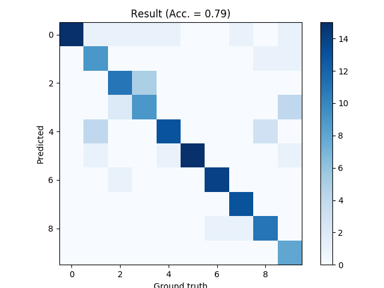

# 第七回B4輪講課題


## 課題の概要

本課題では，B4輪講のまとめとしてパターン認識を行う．


## 課題

1. 単一数字発話を認識してみよう！
2. プレゼンを準備をしよう！


## Free Spoken Digit Database (FSDD)

- 単一数字（0～9）発話データセット
  - 話者数：4, 発話数：各50
  - 学習：1800サンプル，テスト：200サンプル
    - 秘密のシードによりテストセットを作成しており、テストデータの答えは隠してあります (音声聴けばわかりますが・・)
  - 発話区間を切り出すスクリプトあり


## 課題管理者の準備 (B4のみなさんはスキップしてください)

```sh
./setup.sh admin
python make_label.py --seed {秘密のシード}
```


## 課題の進め方

以下はPython3.8.0で動作を確認しています。

1. 実行環境のセットアップ

    ```sh
    $ ./setup.sh
    ```

2. 自由に予測モデルを作りましょう

   - B4輪講で学んだことなど自由な発想で予測モデルを作ってみましょう
     - 特徴量： MFCC, PCAなど
     - 識別器：GMM, HMM, MLPなど
     - k-meansクラスタリングなど教師なし学習
   - 外部ライブラリの使用可
     - 思いついたことはどんどん試してみてください

3. テストデータに対して推論を行い結果を計算しましょう

   - テストデータに対する最終的な結果を事前に配布するので、それを使って5回推論を行い、正解率の平均値を計算してください
   - 平均値の計算だけでなく、信頼区間をプロットするなどの工夫をするとより良いです


## ベースラインの実行
### keras / tensorflowの場合

  - kerasのバックエンドをtensorflowに変更

    ```sh
    $ vim ~/.keras/keras.json
    ```


    変更前

    ```json
    {
        "image_dim_ordering": "th",
        "backend": "theano",
        "epsilon": 1e-07,
        "floatx": "float32"
    }
    ```


    変更後

    ```json
    {
        "image_dim_ordering": "tf",
        "backend": "tensorflow",
        "epsilon": 1e-07,
        "floatx": "float32"
    }
    ```

  - ベースラインの実行


    ```sh
    $ python baseline.py
    ```

    乱数によってうまく学習できないことがあるので何度か試してみてください

### pytorch_lightningの場合
- ディレクトリ移動

    ```sh
    $ cd pytorch_lightning/
    ```

- 適当な仮想環境下で必要モジュールを準備
    ```sh
    $ pip install -r requirement.txt
    ```

- ベースラインの実行
    ```sh
    $ python baseline.py
    ```

- 詳しくは `pytorch_lightning/README.md` を参照

**注意**

​	インストールされるtensorflowはcpu版です．

​	gpuを使いたい場合はcpu版を一度アンインストールし，

​	gpu版をインストールするのを推奨します．

​	またサーバでgpuを使うときはslurmでジョブを管理するなど注意が必要です．

​	詳しくは[サーバマニュアル](https://github.com/TakedaLab/ServerManual#slurm%E3%81%AE%E7%89%B9%E5%BE%B4)を参照するか先輩に聞いてください．


## 結果例（ベースライン）



## ヒント・注意点

- テストデータは最後に推論に使うだけにする（学習はもちろん、ハイパーパラメータの決定にも使わない）
  - モデルを色々試行錯誤するときは、学習セットからバリデーションセットを切り出しておき、それで計算した指標をもとに学習したりハイパーパラメータを決定したりする
- 音声は時系列データ
  - 系列長が一定ではない
- 重要なのはデータの理解
  - Deepにすればいいというものではない
  - 前処理やデータの特徴を把握することが大事
- データ数が少ない
  - 外部データの利用は禁止
  - データをいじって疑似的に学習データを増やすのはOK
- baseline.pyを参考にしつつ自分だけの最強認識モデルを作成しよう！


## 課題発表会について

- **全員発表**
  - 評価基準：5回推論を行った正解率（Accuracy）の平均値
  - 用いた特徴量，識別器について簡単に説明
    - どういった意図で使用したか説明できると◎
  - 考察


## 余裕がある人は

- 出来る限り可読性，高速化を意識しましょう

  - 冗長な記述はしていませんか
  - for文は行列演算に置き換えることはできませんか

- 関数は一般化しましょう

  - 課題で与えられたデータ以外でも動作するようにしましょう
  - N次元の入力にも対応できますか

- 処理時間を意識しましょう

  - どれだけ高速化できたか，`scipy`の実装にどれだけ近づけたか
  - pythonで実行時間を測定する方法は[こちら](http://st-hakky.hatenablog.com/entry/2018/01/26/214255)

  ​

## 注意

- 武田研究室の場合はセットアップで作成した`virtualenv`環境を利用すること

  - アクティベート例：`source ~/workspace3/myvenv/bin/activate`
  - アクティベート後`pip install ...`でライブラリのインストールを行う

- 自分の作業ブランチで課題を行うこと

- プルリクエストを送る前に[REVIEW.md](https://github.com/TakedaLab/B4Lecture/blob/master/REVIEW.md)を参照し直せるところは直すこと

- プルリクエストをおくる際には**実行結果の画像も載せること**

- 作業前にリポジトリを最新版に更新すること

  ```
  $ git checkout master
  $ git fetch upstream
  $ git merge upstresam/master
  ```

  ​
