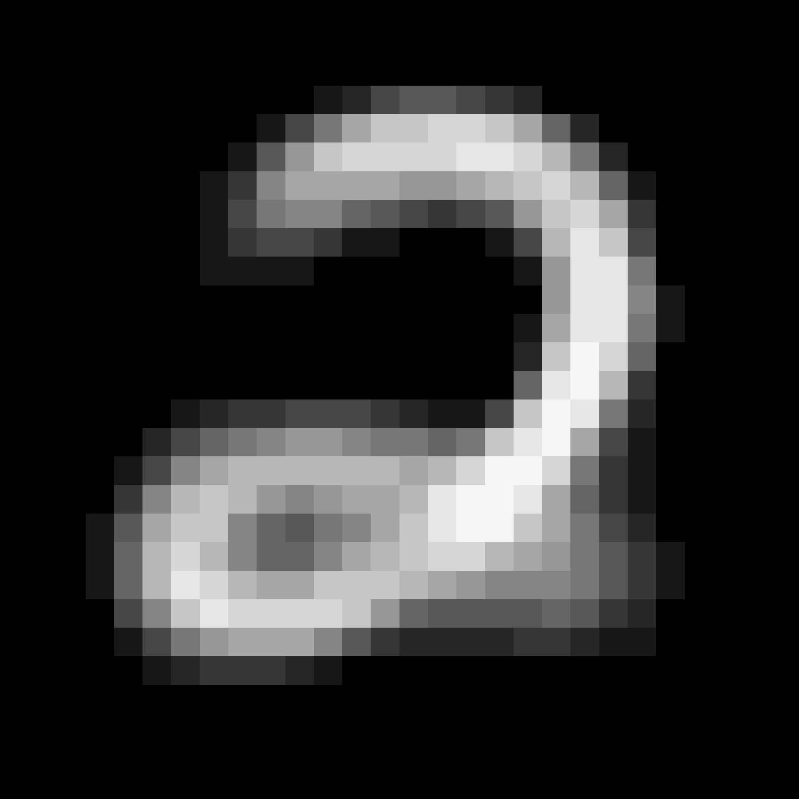
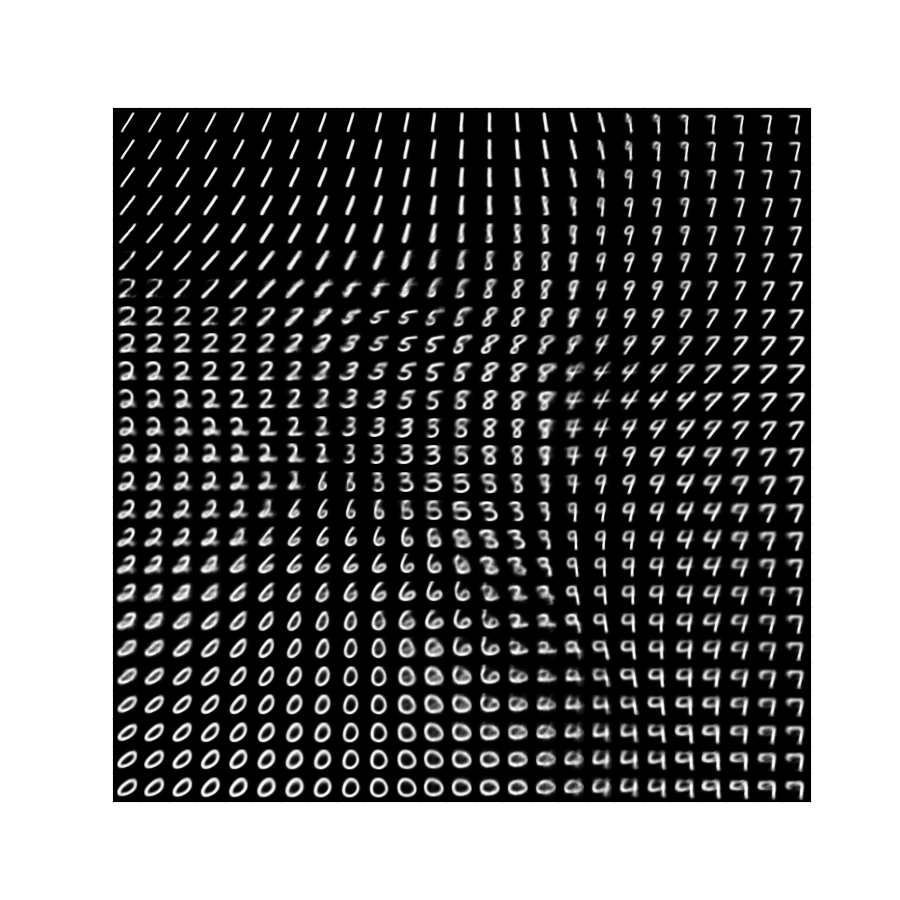

# 第八回B4輪講課題


## 課題の概要

本課題では，VAEを画像データセットを用いて学習する．


## 課題

1. 画像を生成してみよう！
    - 学習コードを完成させましょう
        - VAEs/VAE.py内の `# TODO` 部分を穴埋めしてみましょう
        - 参考までに`VAE`クラスにConstructerを記入しています
        - VAEs/VAE_example.pyが解答例です
    - 完成させたら以下の実行例を参考にして実行しますと，結果の画像も生成されます
2. 修正箇所を探してみよう！
    - このコードのままだと再現性がないという問題があるため，何を追加すればよいか考えてみましょう
3. いろいろいじってみよう！（どれだけやるかは任意）
    - 参考までにmain.py内の`Main`クラスにいくつか引数を用意しました
        - `--z_dim` : 潜在変数の次元数 (注意：この値を2以外にした場合，このコードのままだと結果の可視化ができなくなります．そのため，主成分分析やt-SME等次元圧縮する方法を用いて可視化するコードも書く必要があります．)
        - `--h_dim` : 中間層の次元数
        - `--drop_rate` : ドロップアウト率
        - `--learning_rate` : 学習率
        - `train_size_rate` : 学習データの割合
    - etc...


## 準備
Pythonのバージョンは3.11.9を推奨します <br>
パッケージのインストール方法は以下の2種類があります

1．requirements.txtを使用する方法
```sh
pip install -r requirements.txt
```

2. poetryを使用する方法
```sh
poetry env use {Pythonのバージョンがあるフォルダ}/bin/{Pythonのバージョン}
poetry env info
poetry install 
```
`pyproject.toml`に記載されているパッケージには formatter (balck, isort) が含まれているため，自分の開発環境でやりたい場合は`poetry install --no-dev`を実行してください．

## 実行例
`run.sh`にも実行例が記載されています．
```sh
python main.py main --z_dim 2 --h_dim 400 --drop_rate 0.2 --learning_rate 0.001 --train_size_rate 0.8
```

- Poetryを使用する場合は先頭に`poetry run`をつけてください

## 結果の例





