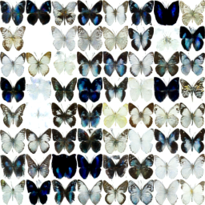

# 第九回B4輪講課題


## 課題の概要

本課題では，Diffusion modelを画像データセットを用いて学習する．


## 課題

1. 画像を生成してみよう！
  - 学習コードを完成させる
    - main.py内の `# TODO` 部分を穴埋めしよう
    - main_example.pyが解答例
  - 学習を行う
  - 生成し，結果をプロット
    - Diffusion processをアニメーションにできるとベター
2. いろいろいじってみよう！（どれだけやるかは任意）
  - ノイズ推定モデルを変更する
  - 別のデータセットを使用する
  - ノイズスケジューリングを変える
  - 学習時/推論時のタイムステップを変える
  - etc...


## 準備

```sh
pip install -r requirements.txt
```

## 実行

```sh
python main.py datadir=<データダウンロード先の絶対パス>
```
もしくは `conf/default.yaml` の１行目を
```yaml
datadir: <データダウンロード先の絶対パス>
```
に書き換えたうえで
```sh
python main.py
```
## 結果の例



## 参考資料

[Diffusers (別のノイズ推定モデルを使いたい場合)](https://huggingface.co/docs/diffusers/api/models/overview)
[Hydra（ハイパーパラメータの設定）](https://hydra.cc/docs/intro/)

